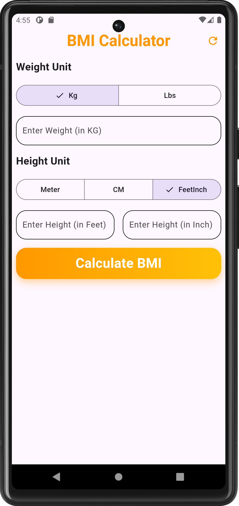
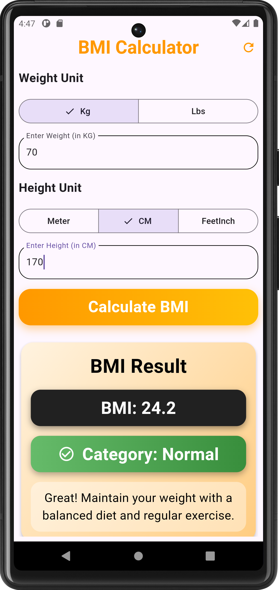
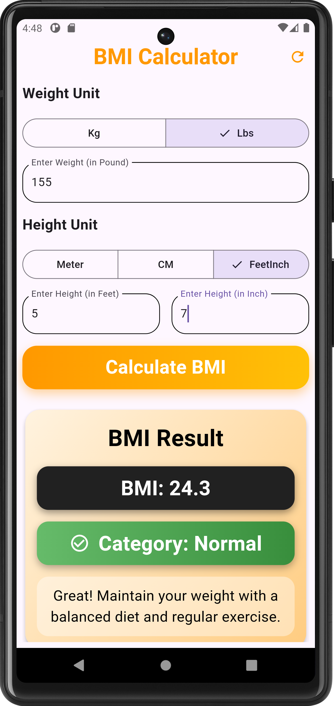
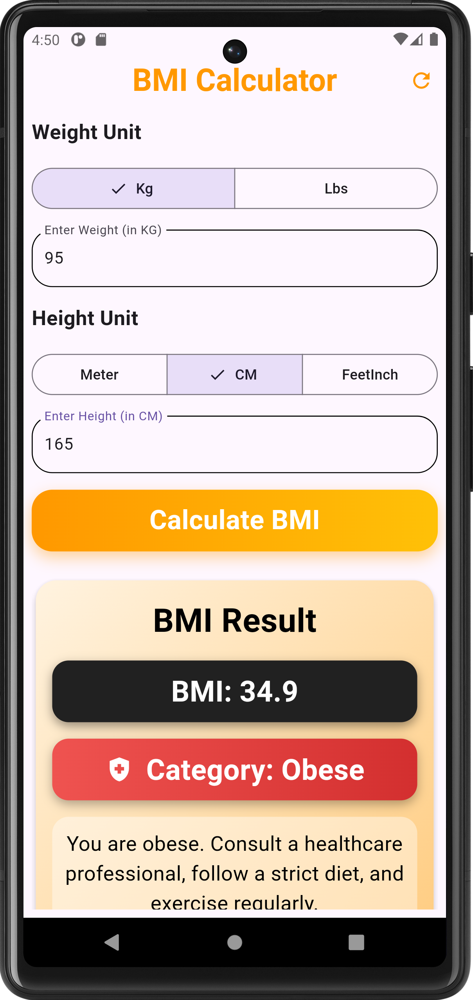
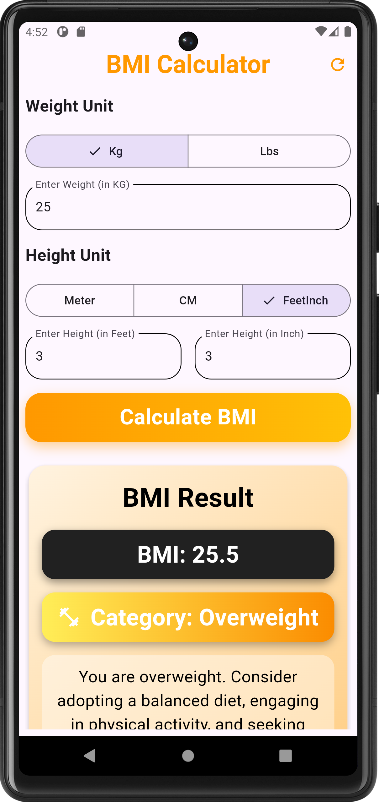
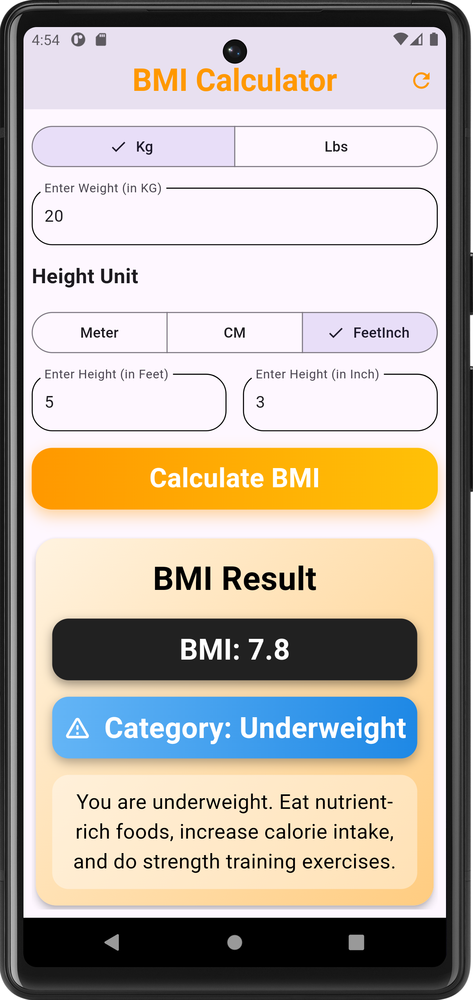

# BMI Calculator

A Flutter-based BMI (Body Mass Index) Calculator app that supports multiple unit systems and provides health recommendations based on BMI categories.

## Features

- **Multiple Weight Units**: Support for Kilograms (kg) and Pounds (lbs)
- **Multiple Height Units**: Support for Meters (m), Centimeters (cm), and Feet + Inches
- **Decimal Input Support**: Accept precise measurements (e.g., 70.5 kg, 1.72 m, 5 ft 7.5 in)
- **Real-time Calculation**: Instant BMI calculation with category classification
- **Color-coded Results**: Visual feedback based on BMI category
- **Health Recommendations**: Personalized suggestions for each BMI category
- **Input Validation**: User-friendly error handling for invalid inputs
- **Refresh Functionality**: Quick reset using refresh button or pull-to-refresh gesture

## BMI Formula & Unit Conversions

### BMI Calculation Formula
```
BMI = weight (kg) / [height (m)]²
```

### Unit Conversions Used

**Weight Conversion:**
- Kilograms to Pounds: `kg = lb × 0.45359237`

**Height Conversions:**
- Centimeters to Meters: `m = cm / 100`
- Feet & Inches to Meters: `m = (feet × 12 + inches) × 0.0254`

## BMI Categories & Color Mapping

| BMI Range | Category | Color | Icon |
|-----------|----------|-------|------|
| < 18.5 | Underweight | Blue | ⚠️ Warning |
| 18.5 - 24.9 | Normal | Green | ✓ Check Circle |
| 25.0 - 29.9 | Overweight | Orange | 💪 Fitness |
| ≥ 30.0 | Obese | Red | 🏥 Health |

### Health Recommendations

- **Underweight**: Eat nutrient-rich foods, increase calorie intake, and do strength training exercises.
- **Normal**: Great! Maintain your weight with a balanced diet and regular exercise.
- **Overweight**: Consider adopting a balanced diet, engaging in physical activity, and seeking professional guidance for weight management.
- **Obese**: Consult a healthcare professional, follow a strict diet, and exercise regularly.

## Test Cases

### Verified Results

1. **Test Case 1**
   - Input: 70 kg, 170 cm
   - Expected BMI: ≈ 24.2
   - Category: Normal (Green)
   - Status: ✅ Passed

2. **Test Case 2**
   - Input: 155 lb, 5'7"
   - Expected BMI: ≈ 24.3
   - Category: Normal (Green)
   - Status: ✅ Passed

3. **Test Case 3**
   - Input: 95 kg, 165 cm
   - Expected BMI: ≈ 34.9
   - Category: Obese (Red)
   - Status: ✅ Passed
---

## Screenshots

<div align="center">

<table>
  <tr>
   <td align="center">
      <br/>
      <b>User Interface</b>
    </td>
    <td align="center">
      <br/>
      <b>Normal Category</b>
    </td>
    <td align="center">
      <br/>
      <b>Underweight</b>
    </td>
  </tr>
  <tr>
     <td align="center">
      <br/>
      <b>Obese Result</b> 
    </td>
    <td align="center">
      <br/>
      <b>Overweight</b>
    </td>
    <td align="center">
      <br/>
      <b>Underweight</b>
    </td>
  </tr>
</table>
</div>
---
**Note**: This app provides general BMI calculations. For personalized health advice, please consult healthcare professionals.
